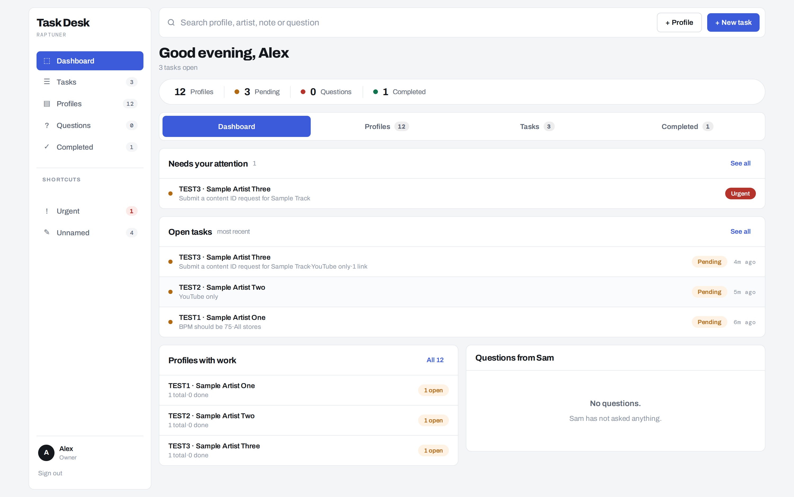
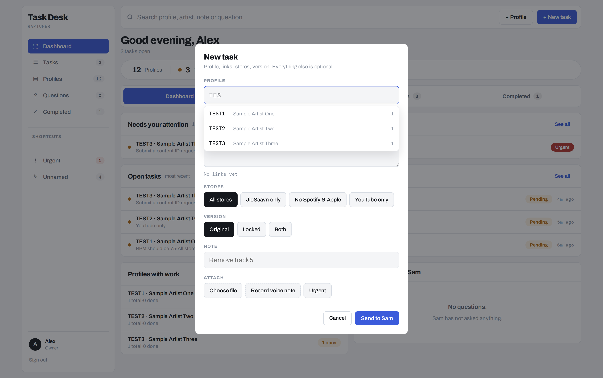
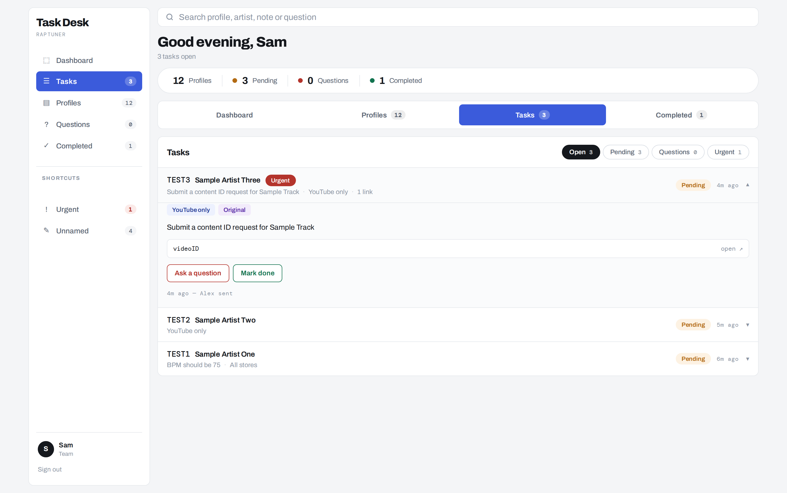
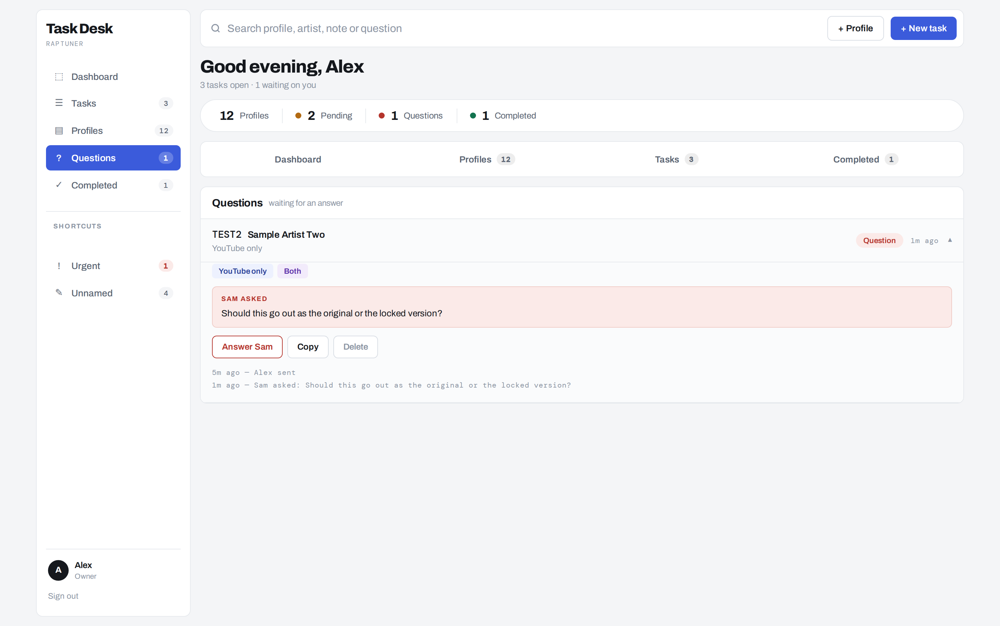
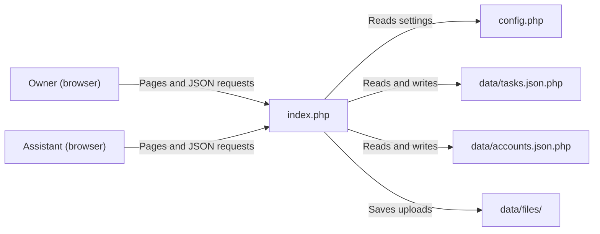

# Task Desk

A private web app for sending, tracking and answering day-to-day work tasks between a music distribution business owner and their assistant.

> This public repository contains the application code with **sample data only**. It has no real passwords, artist names, tasks or uploaded files.

## The problem it solves

Our business manages music releases and accounts for multiple artists. The owner gives the assistant instructions, and the assistant uploads tracks to distribution accounts, handles the artists' Spotify, YouTube and Apple Music accounts, and replies to emails.

We used to send these tasks over WhatsApp. That caused three problems:

- **No reliable record.** Instructions were buried in chat history among other messages.
- **No clear status.** It was hard to tell which tasks were finished, which were still waiting and which were urgent, so progress had to be tracked by hand.
- **Questions got lost.** When the assistant needed to clarify something, the question and the answer were separate from the original instruction.

Task Desk replaces that chat thread with one shared place. Every task belongs to an artist profile, has a clear status and keeps its own history.

## Key features

**For the owner**

- Create a task for an artist profile with:
  - one or more video links
  - a store option (for example *All stores* or *YouTube only*)
  - a version option (*Original*, *Locked* or *Both*)
  - a note
- Attach files (audio, images, PDF or text, up to 60 MB each) or record a voice note directly in the browser.
- Mark a task as **urgent** so it appears under *Needs your attention* and in the *Urgent* shortcut.
- Answer the assistant's questions. The answer is added to the task note and the task goes back to *Pending*.
- Reopen, delete or copy a task.
- Manage artist profiles: add a profile (code and artist name), rename it, or delete it (only when it has no tasks). Using a new code in a task creates the profile automatically.

**For the assistant**

- See all open tasks, expand a task to view its links, files and note, and play voice notes in the page.
- **Ask a question** about a task. The task moves to *Question* status until the owner answers.
- **Mark done** when finished.

**For both**

- Dashboard with *Needs your attention*, *Open tasks*, *Profiles with work* and *Questions*.
- Task status counts: Pending, Questions, Completed and Urgent.
- Search across profile codes, artist names, notes, questions, stores and versions.
- Activity log on each task (who sent, asked, answered, completed or reopened it, and when).
- The list refreshes every 15 seconds and when the browser tab becomes active. If new tasks arrive while the tab is in the background, a browser notification is shown (when the user allows notifications).
- Keyboard shortcuts for the owner: `n` for a new task, `/` to search, `Esc` to close a form.
- Layout adjusts for narrow (mobile) screens.

## Screenshots

All screenshots use the sample data in this repository.

**Owner dashboard:** urgent work, open tasks, profiles with work and questions in one view.



**New task form:** profile search by code or artist name, store and version options, note, file attachment, voice note and urgent flag.



**Assistant view of a task:** store and version tags, note, link, *Ask a question* and *Mark done* actions, and the activity log.



**Owner answering a question:** the assistant's question is shown on the task with an *Answer* button.



## How it works

Task Desk is a single PHP file (`index.php`) with a separate settings file (`config.php`). It has no database. Data is stored in JSON files inside a `data/` folder, which the app creates on first run.

1. **Sign in.** The login form asks for a password only. `index.php` compares it with the owner and assistant passwords in `config.php`, stores the role in the PHP session and creates a random security token for that session.
2. **Load the page.** After sign-in, the same file returns the HTML, CSS and JavaScript for the interface. Names, store options and version options from `config.php` are passed into the page.
3. **Fetch data.** The JavaScript calls `index.php?api=list`, which returns all tasks and profiles as JSON. The browser builds each view (dashboard, tasks, profiles, questions, completed) from that data. It repeats this every 15 seconds.
4. **Make a change.** Actions such as creating a task, asking or answering a question, marking done or renaming a profile send a JSON request to `index.php?api=<action>` with the session token. PHP checks the token and the user's role, validates the input, updates the JSON file and replies `{"ok": true}` or an error message.
5. **Upload files.** When a task has attachments, the browser first uploads them to `?api=upload`. PHP checks each file, saves it under a new random name in `data/files/`, and returns the stored names. The task is then created with those names.



**Task status flow:** a new task starts as **Pending**. The assistant can move it to **Question**, and the owner's answer returns it to **Pending**. Either user can mark it **Done**, and the owner can reopen it.

## Tech stack

- **PHP:** server logic, sessions, login and the JSON API (no framework)
- **JSON files:** data storage (no database)
- **HTML, CSS and plain JavaScript:** interface (no front-end framework)
- **Browser APIs:** Fetch, MediaRecorder (voice notes), Notifications and Clipboard
- **Apache `.htaccess` rules:** turn off folder listing and block direct access to PHP files inside `data/`
- **Google Fonts:** Archivo and DM Mono
- **Shared PHP web hosting:** the app's folder-permission message is written for Hostinger's File Manager

## Challenges solved and technical decisions

**Storage without a database.** The app has two users and a modest number of tasks, and it runs on shared hosting. JSON files avoid setting up and maintaining a database, and they are easy to back up by copying one folder. The trade-off is covered under known limitations below.

**Keeping data files private.** A JSON file in a web folder could be downloaded by anyone who guesses its URL. Each data file is saved with a `.php` extension and begins with a line of PHP that returns *403 Forbidden*. If someone requests the file in a browser, the server runs that line and stops. When the app reads the file, it strips that first line before decoding the JSON. This works even on servers that ignore `.htaccess`. The app also writes a `.htaccess` file into `data/` that turns off folder listing and blocks direct requests to PHP files in that folder.

**Avoiding half-written files.** Saves are written to a temporary file with an exclusive lock and then renamed over the real file. A failed write leaves the previous version in place instead of a corrupted file.

**Permissions enforced on the server.** Hiding buttons in the interface is not enough, because anyone can send a request directly. PHP checks the role before every owner-only action. Only the owner can create, delete, reopen or mark tasks urgent, answer questions and change profiles. The assistant can only ask questions and mark tasks done.

**Protecting against forged requests.** Each session gets a random token (`random_bytes`), and every change must include it. Passwords and tokens are compared with `hash_equals`.

**Safer file uploads.**

- Only listed file extensions are accepted (audio, images, PDF and text).
- Each file is limited to 60 MB.
- Every file is saved under a new name made from the date, time and random characters, so an uploaded file cannot overwrite another file or keep a harmful name.
- The original name is cleaned before it is displayed.

**Input validation and output escaping.**

- Profile codes are reduced to capital letters and numbers.
- Text fields are trimmed and length-limited.
- Links are kept only if they start with `http://` or `https://`.
- In the browser, all user-entered text is escaped before it is inserted into the page, so text cannot run as HTML or script.

**Staying up to date without extra services.** Rather than adding a real-time server, the page checks for changes every 15 seconds and whenever the tab becomes active, and uses browser notifications for new tasks. This works on basic shared hosting.

**Settings separate from code.** Passwords, names, store options and version options live in `config.php`, so day-to-day changes do not require editing the application code.

## My role and how it was built

I created Task Desk to fix the problems we had managing work over WhatsApp. I identified the problem, decided what the system needed to do and shaped it around how our business works:

- tasks linked to artist profiles
- store and version choices
- a question-and-answer loop between owner and assistant
- pending, done and urgent tracking

It was built in two stages:

- **January 2026:** work started on the first version.
- **May 2026:** the interface was redesigned and new features were added: voice notes, file attachments and marking tasks as urgent.

I use Task Desk as the owner, and our assistant uses it to receive and complete tasks.

## Status and build dates

- **Started:** January 2026
- **Completed:** September 2026
- **Status:** completed and in use within the business

Added to GitHub September 2026.

### Development timeline

Earlier versions were not kept in Git, so this repository starts from the completed September 2026 version. The timeline below is a summary of how the project developed.

| When | What happened |
|---|---|
| January 2026 | Work started on the first version, to replace the WhatsApp-based task workflow with a shared task system. |
| May 2026 | The interface was redesigned, and voice notes, file attachments and marking tasks as urgent were added. |
| September 2026 | Project completed and added to GitHub, with private data removed and sample data added. |

**Known limitations**

- Passwords are stored in plain text in `config.php` (which is kept out of this repository).
- There is no limit on login attempts, and the session ID is not renewed at sign-in.
- Uploaded files in `data/files/` can be opened by direct URL without signing in. They are protected only by random file names and disabled folder listing.
- Deleting a task does not delete its uploaded files.
- The app reads a data file, changes it and writes it back without locking the whole process. Two changes saved at the same moment could overwrite each other. This is unlikely with two users but would matter with more.
- There are no automated tests.

## Installation and running

### Requirements

- PHP 7.0 or later (the code uses `random_bytes` and `hash_equals`)
- Write permission for the app's folder, so it can create `data/`
- A modern web browser
- Recording voice notes needs a secure page (HTTPS or `localhost`) and microphone permission

### Run locally

1. Download or clone this repository.
2. In the project folder, copy the example settings file:
   ```bash
   cp config.example.php config.php
   ```
   On Windows, copy `config.example.php` and rename the copy to `config.php`.
3. Open `config.php` and replace `YOUR_OWNER_PASSWORD` and `YOUR_ASSISTANT_PASSWORD` with your own passwords. Change the names and options if you like.
4. Start PHP's built-in web server from the project folder:
   ```bash
   php -S localhost:8000
   ```
5. Open `http://localhost:8000` in your browser and sign in with the owner password. Use a second browser or a private window to sign in as the assistant.

On first run, the app creates `data/`, `data/files/`, `data/.htaccess`, an empty task list and twelve sample profiles.

Note: PHP's built-in server does not read `.htaccess` files. The data files are still protected by their 403 first line.

### Deploy to shared PHP hosting

1. Create a folder on your web host, for example `tasks/`.
2. Upload `index.php` and your own `config.php` (with real passwords set) into that folder. `config.example.php` is not needed on the server.
3. Make sure the folder is writable by PHP (commonly permission `755`). If it is not, the app shows a *Cannot save yet* message.
4. Visit the folder's URL over HTTPS and sign in.

### Useful settings

- **Passwords, names, store options, version options:** `config.php`
- **Time zone:** the `date_default_timezone_set('Asia/Kolkata')` line near the top of `index.php`
- **Starting profiles:** the `$SEED` list in `index.php`, used only when no profile file exists yet
- **Start again with empty data:** stop the app and delete the `data/` folder

## Copyright

© 2026 Raptuner Distribution Private Limited. All rights reserved. No licence granted.
